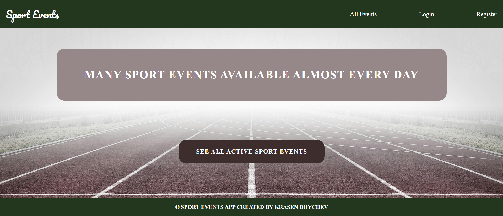
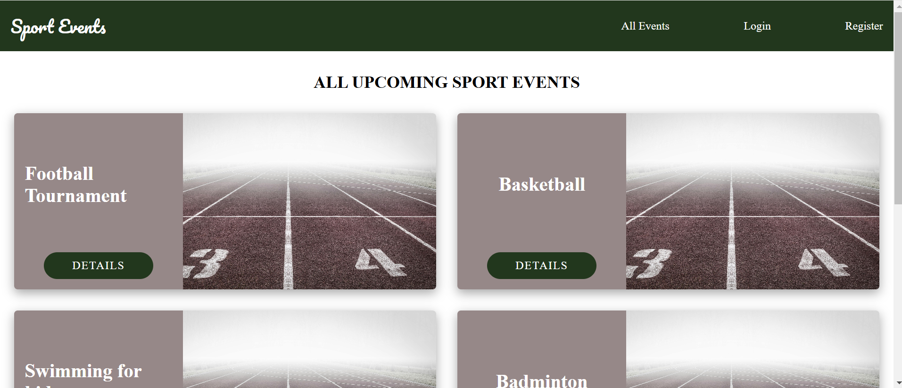
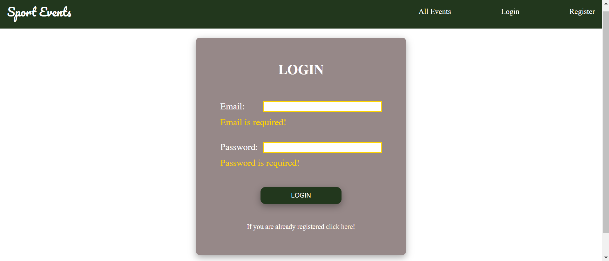
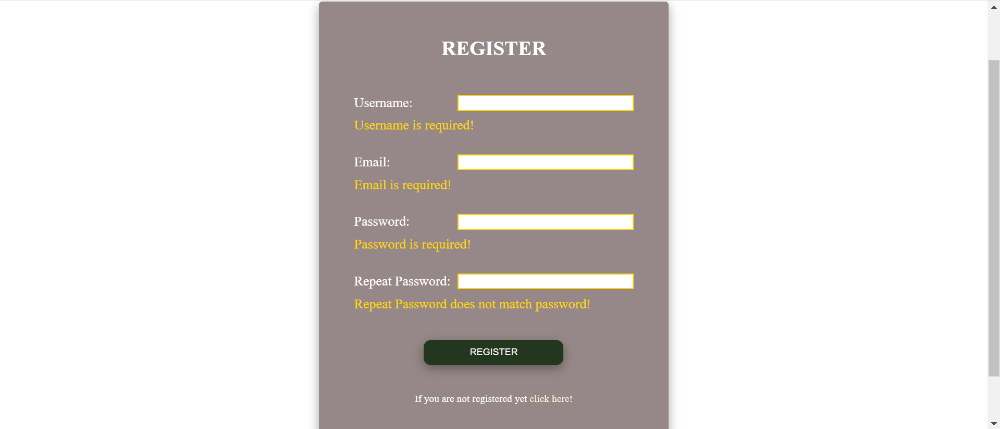
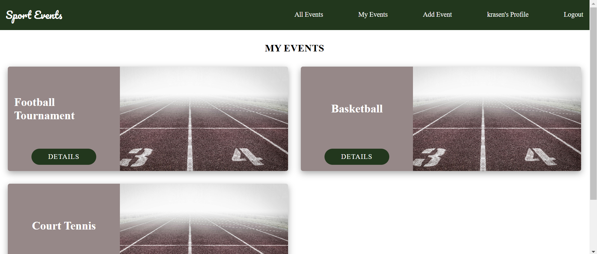
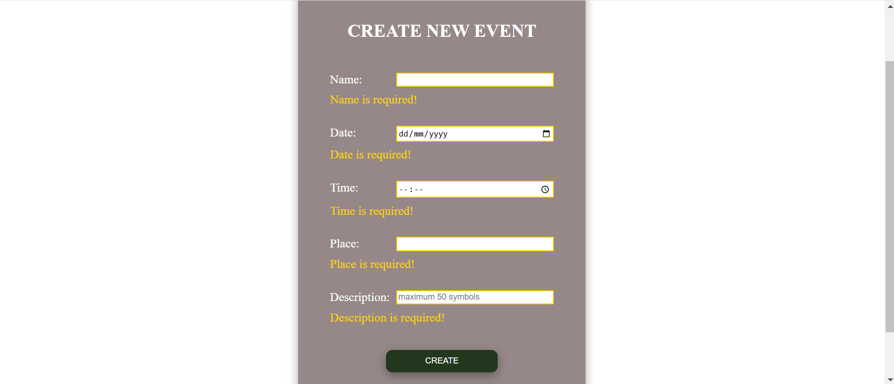
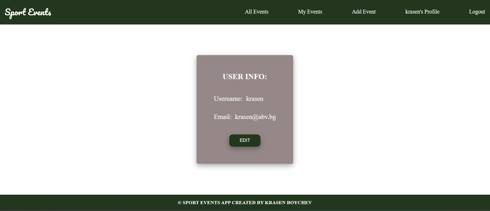
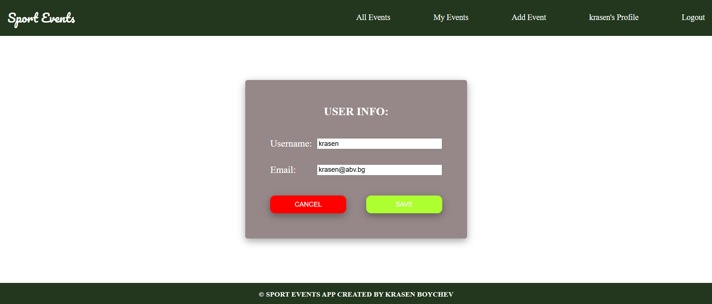
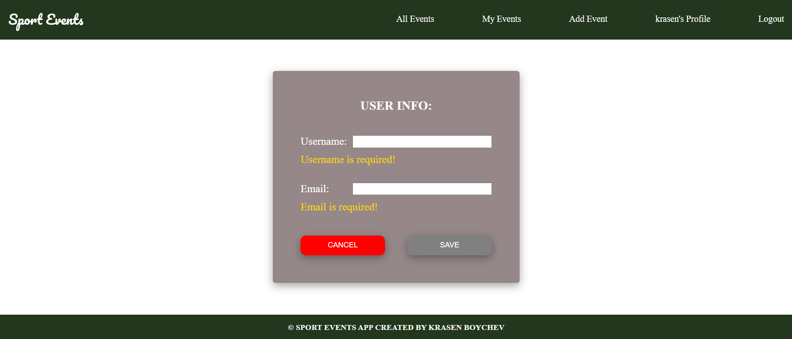

# Sport Events

Sport Events is a project built for SoftUni, Angular Exam. It is a website where users can join or cancel events and also they can create their own events. When an event is created, the owner can edit it or delete it. Authenticated users can access their account details and edit their username and email. Not logged in users have an access to see all events and read their details, but if they want to join or cancel an event, they need to login or register.

There are implemented UserService, EventService and ErrorMsgService. The UserService keeps an information about the authenticated user and is being injected in the Router Guards, so logged in users cannot access Login and Register Pages, while not logged in users cannot access teh following pages: My Events, Add Event, Edit Page, My Profile. The EventService holds an information about the current event and in case the owner wants to edit it, the data from the event fulfills automatically in the Edit Page input fields. The ErrorMsgService works as a global service and shows the error messasges for 3 seconds over the current content on the top right corner of the screen and then they disappear.

The project uses MongoDB to store the records.

## Description

* ### Not authenticated users have access to Home, All Events, Login and Register pages.

  - #### The Home Page has a link to the All Events Page:
 
  

  - #### The All Events Page shows all events or 'No events available at the moment!':

  

   - #### The Login Page has validation for all fields:

  

   - #### The Register Page has validation for all fields:

  


* ### Authenticated users have access to Home, All Events, My Events, Add Event, Edit Event and My Profile pages.

 - #### The My Events Page shows events created by the user:
 
  

  - #### The Add Event Page has validation for all fields:
 
  

   - #### The My Profile Page shows the user details, edit button can be clicked and the user details automatically fullfill the form. All fields have the needed validation:
 
  

  

  


## Getting Started

### Installing

* Clone the repository or download all files.

### Executing program
* Run Client
```
cd sport-events-app
```
```
npm install
```
```
ng serve
```

* Run Server
```
cd server
```
```
npm install
```
```
npm start
```
